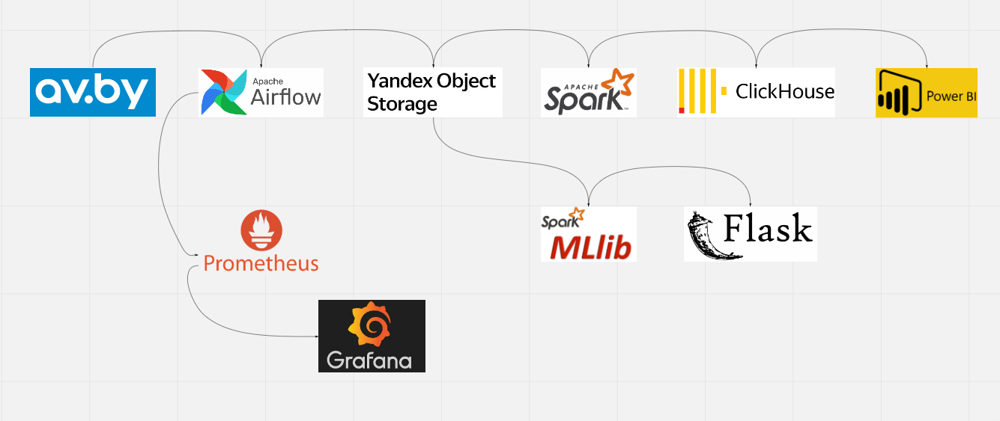
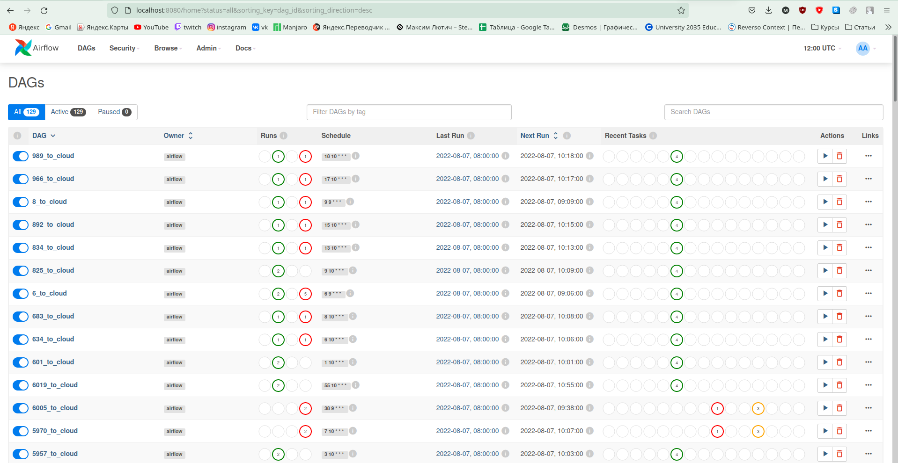
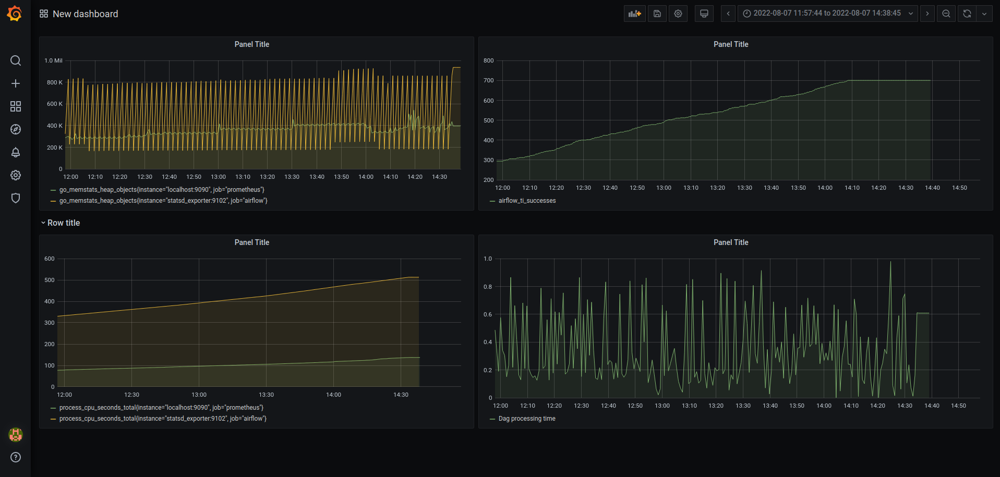
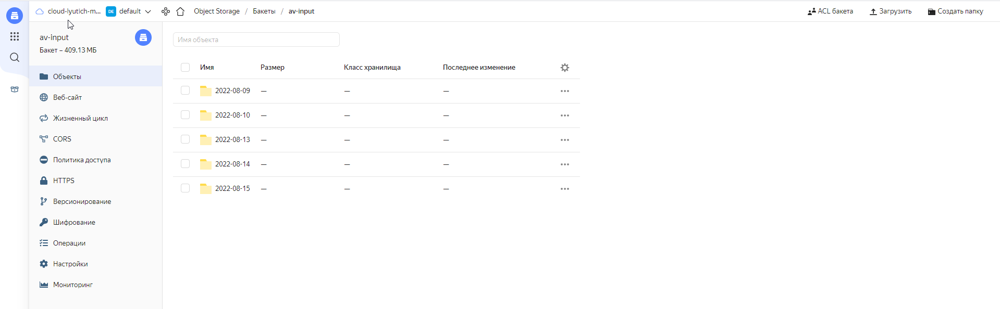
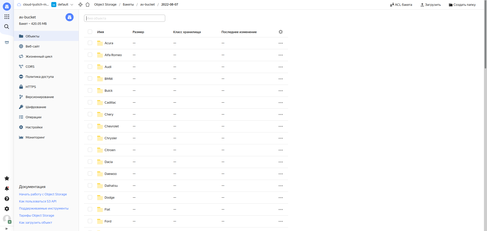
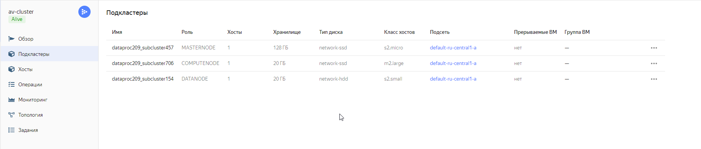

# Project of data visualization and ML prediction model of AVBY car offers using Airflow, Grafana, YandexCloud, Spark, ClickHouse, PowerBI, Flask
## Process chart

The diagram above shows the data flow in the project. At the first stage of the data flow,  Raw data is being loadedweb pages are scraping from the site AV.BY. It is done using BeautifulSoup and site Api. Next raw data loaded into Yandex Object Storage(s3 bucket). At the next stage raw data is processing using Spark in DataProc cluster and loading into DWH on ClickHouse. This proccess is orchestrated using Airflow which is running in Docker container. There are DAG factory for everyone brand in Airflow enveirment.

After the data is loaded into ClickHouse, i connect to PowerBI using ODBC driver and visualize the data.

The cleaned data is also using to create ML model with SparkML library and Flask framework for deploying model

### Factory of dag in Airflow

### Dag tasks

### Visualization metric from Airflow by Grafana
Collecting metrics from Airflow occurs with Prometheus and their visualization with Grafana.

### Schema in s3 bucket and DataProc cluster

#

#

# Files

- docker-compose.yaml - File that allows to use Airflow
- DataProcessing.py - Spark processing in DataProc Cluster
- dags/extract_dag.py - Dags factory
- dags/scraper.py - Site scrapper
- clickhousedb.sql - Schema of DWH in ClickHouse
- files/prometheus.yml, files/statsd_mapping.yml - Files that allows collect metrics from Airflow
