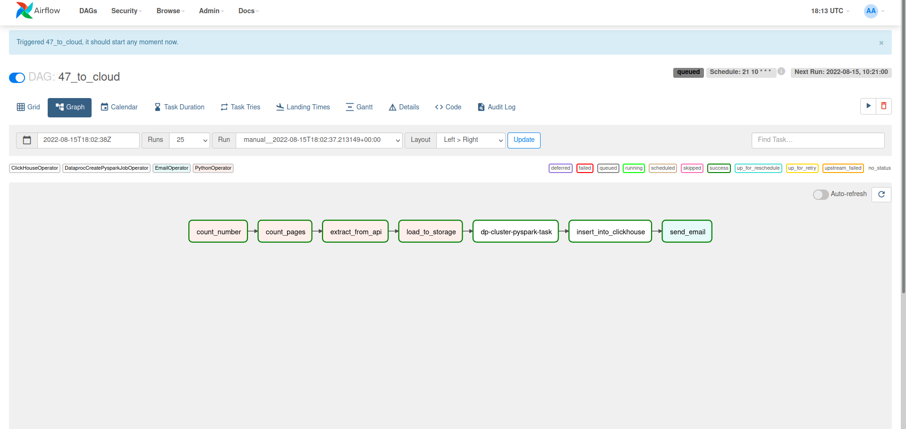

# Project of data visualization and ML prediction model of AVBY car offers using Airflow, Grafana, YandexCloud, Spark, ClickHouse, PowerBI, Flask
## Process chart

The diagram above shows the data flow in the project. At the first stage of the data flow,  Raw data is being loadedweb pages are scraping from the site AV.BY. It is done using BeautifulSoup and site Api. Next raw data loaded into Yandex Object Storage(s3 bucket). At the next stage raw data is processing using Spark in DataProc cluster and loading into DWH on ClickHouse. This proccess is orchestrated using Airflow which is running in Docker container. There are DAG factory for everyone brand in Airflow enveirment.

